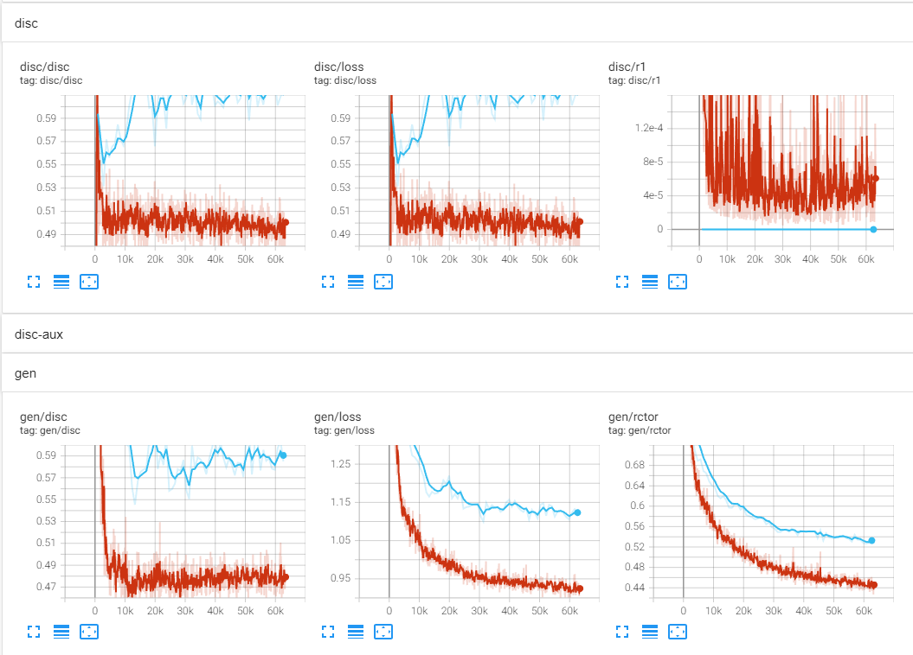
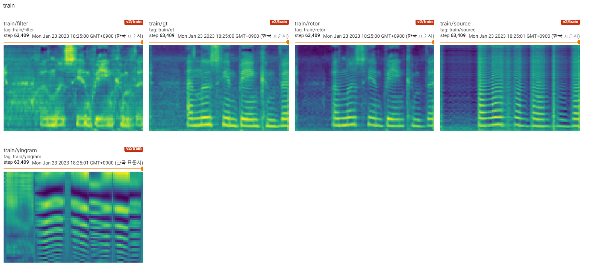

# torch-nansy
Torch implementation of NANSY, Neural Analysis and Synthesis, arXiv:2110.14513

- Neural Analysis and Synthesis: Reconstructing Speech from Self-Supervised Representations, Choi et al., 2021. [[arXiv:2110.14513](https://arxiv.org/abs/2110.14513)]

## Requirements

Tested in python 3.7.9 conda environment.

## Usage

Initialize the submodule and patch.

```bash
git submodule init --update
cd hifi-gan; patch -p0 < ../hifi-gan-diff
```

Download LibriTTS[[openslr:60](https://www.openslr.org/60/)], LibriSpeech[[openslr:12](https://www.openslr.org/12)] and VCTK[[official](https://datashare.ed.ac.uk/handle/10283/2651)] datasets.

Dump the dataset for training.

```
python -m speechset.utils.dump \
    --out-dir ./datasets/dumped
```

To train model, run [train.py](./train.py)

```bash
python train.py \
    --data-dir ./datasets/dumped
```

To start to train from previous checkpoint, --load-epoch is available.

```bash
python train.py \
    --data-dir ./datasets/dumped \
    --load-epoch 20 \
    --config ./ckpt/t1.json
```

Checkpoint will be written on TrainConfig.ckpt, tensorboard summary on TrainConfig.log.

```bash
tensorboard --logdir ./log
```

To inference model, run [inference.py](./inference.py)

```bash
python inference.py \
    --ckpt ./ckpt/libri100_73.ckpt \
    --hifi-ckpt ./ckpt/hifigan/g_02500000 \
    --hifi-config ./ckpt/hifigan/config.json \
    --context ./sample1.wav \
    --identity ./sample2.wav
```

[TODO] Pretrained checkpoints will be relased on [releases](https://github.com/revsic/torch-nansy/releases).

To use pretrained model, download files and unzip it. Followings are sample script.

```py
from nansy import Nansy

ckpt = torch.load('t1_200.ckpt', map_location='cpu')
nansy = Nansy.load(ckpt)
nansy.eval()
```

## Learning curve and Figures

Epoch: 65





## [TODO] Samples
